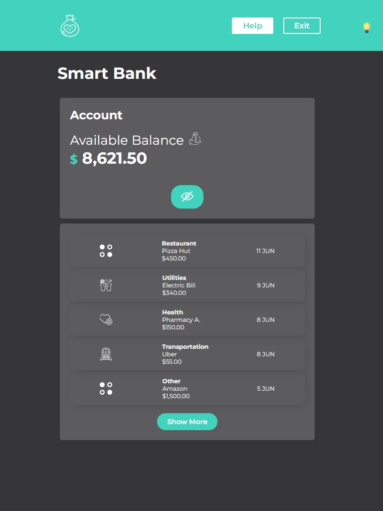

 
  <h1>Smart Bank</h1>

 
   
  
  
  
  
  

## Description

This project is a Smart Bank app developed as part of the React course at Alura Latam. The app features a variety of functionalities including viewing account balance, expenses, and toggling themes.

## Key Features

- **View Account Balance**: Display the available account balance.
- **View Expenses**: List of recent expenses categorized by type.
- **Theme Toggle**: Switch between light and dark themes.

## Screenshots

  
    
   
     
   

## Additional Information

- This project was part of the React course on Alura Latam.
- Developed by Evelin Alvarado.
- Find me on [GitHub](https://github.com/EvelinAlvarado) and [LinkedIn](https://www.linkedin.com/in/evelinalvarado/).

Check out the live project: [Smart Bank](https://smart-bank-react-styled-components.vercel.app/)

### Dependencies

- `styled-components`: Utilized for styling React components in a modular and reusable way.

## Objective

The primary objective of this project is to learn and practice `styled-components` for styling in React, alongside enhancing skills in React and JavaScript.
